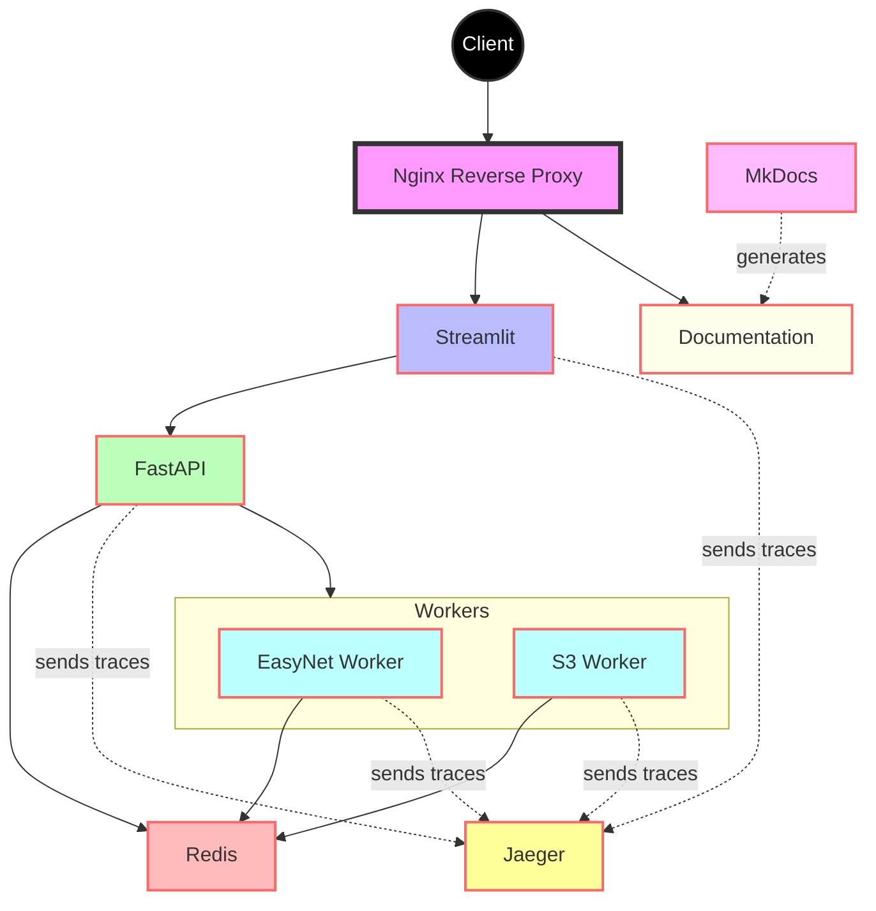

# Architecture

This page describes the architecture of our application stack.

## Container Diagram

Below is a diagram representing the containers in our stack and their relationships:

## Components Description

- **Client**: Represents the end-user interacting with our application.
- **Nginx Reverse Proxy**: Acts as the main entry point, routing requests to either Streamlit or the documentation.
- **Streamlit**: Provides the user interface for our application.
- **FastAPI**: Handles API requests and business logic.
- **Redis**: Used for caching and as a message broker.
- **EasyNet Worker**: Processes network device data.
- **S3 Worker**: Handles S3 bucket operations.
- **MkDocs**: Generates the documentation (not a running container, used during build process).
- **Documentation**: Static files served by Nginx, generated by MkDocs.
- **Jaeger**: Distributed tracing system for monitoring and troubleshooting microservices-based distributed systems.

## Data Flow

1. Client requests come through the Nginx Reverse Proxy.
2. Requests are routed to either Streamlit (for the main application) or directly to the documentation.
3. Streamlit communicates with FastAPI for data and operations.
4. FastAPI interacts with Redis for caching and messaging.
5. Worker containers (EasyNet and S3) process data and communicate via Redis.
6. MkDocs is used to generate the documentation, which is then served by Nginx.
7. Streamlit, FastAPI, and the workers send tracing information to Jaeger for monitoring and debugging purposes.

This architecture ensures a separation of concerns, with each container responsible for a specific part of the application's functionality. The addition of Jaeger provides observability across the entire system, allowing for easier troubleshooting and performance optimization.