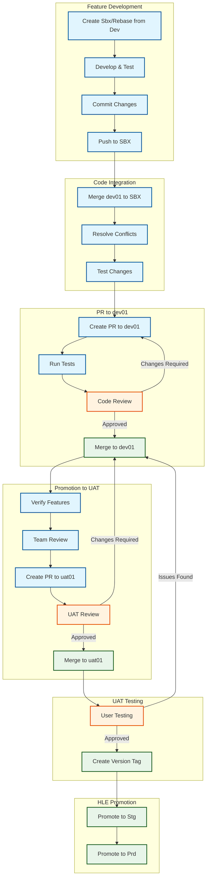

# Development Workflow v2

This page describes the Development workflow and branching strategy for this project.

## Branch Structure

The project is physically divided into two separate repositories:

* High Level Environment (HLE)
* Low Level Environment (LLE)

### High Level Environment

The HLE repository is responsible for maintaining two branches:

* **Production** (prd01)
* **Staging** (stg01)

We maintain two instances of code in these branches for security purposes. Why two? Because both should be identical to each other, using the same sets of environment variables, certificates, domains, etc. The only difference that may exist between them is the amount of resources. In this case, Staging should have limited resources with scaling disabled to simulate high application and infrastructure load.

### Low Level Environment

LLE consists of the following branches:

* **User Acceptance Test** (uat01)
* **Development** (dev01)
* **Sandbox** (sbx01, sbx02, sbx03, etc.)

#### Sandbox Branches
Sandbox is a developer's individual branch. This branch can be completely deleted by the developer and recreated from scratch from the Dev01 branch. The developer should maintain the current state of relationship with the Dev01 branch through frequent `rebase dev01`. When the developer is ready to publish their new feature or change, they create a PR to the Dev01 branch, and other developers should participate in code review.

#### Development Branch
The first continuous, working instance in the Development Workflow. This is the developers' point of contact. Their features, changes, and fixes meet here together and undergo a joint consistency and stability test. This is also the branch from which every developer should start their work, whether through rebase or by creating a new Sbx branch.

#### UAT Branch
The UAT branch is where developers, after ensuring that all their features work on Dev01, promote their code to UAT. Here, users (canary users, beta testers, etc.) are allowed to test new functionalities created by developers from a user perspective.

When everything is approved, the working commit receives a tag (version) of code, which is a kind of development milestone.

## Development Process

### 1. Feature Development
* Create/rebase Sbx branch from Dev01
* Develop and test your changes
* Commit changes with meaningful commit messages
* Push changes to your Sbx branch

### 2. Code Integration
* Merge latest dev01 changes into your Sbx branch
* Resolve any conflicts
* Test your changes thoroughly
* Push final changes to your Sbx branch

### 3. Pull Request Process
* Create a pull request from your Sbx branch to dev01
* Ensure all tests pass
* Add relevant reviewers
* Address review comments and make necessary changes
* Get final approval from reviewers
* Merge into dev01

### 4. Promotion to UAT Process
* Ensure and doublecheck if all features work cohesively together on dev01
* Gather feedback and get a green light from your peers to promote the code
* Create a pull request from dev01 branch to uat01
* Add relevant reviewers
* Address review comments and make necessary changes
* Get final approval from reviewers
* Merge into uat01

### 5. Finish UAT review
* Gather all feedback from test users
* Perform the whole Development Process again
* Once test users approve that their issues were addressed, create a tag for UAT commit

### 6. Promote UAT to HLE 
* [TODO] Detailed steps to be added

### 7. Promote Stg to Prd
* [TODO] Detailed steps to be added

## Development Process Flow Diagram

